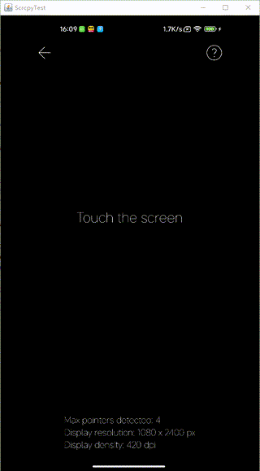

# Scrcpy Client - Android免Root投屏与控制工具

[English](./README.md) | [简体中文](./README_zh.md)

免Root的安卓设备实时显示与控制工具，支持多点触控并提供灵活的二次开发接口，让您轻松实现Android设备的远程控制与屏幕镜像。

## 🖥️ 效果演示




## ✨ 核心功能

- **实时高清投屏** - 低延迟、高画质的屏幕镜像
- **双向控制** - 支持触控和键盘输入控制设备
- **多点触控** - 完整的多点手势支持
- **开发友好** - 简洁的API接口，易于二次开发
- **高效传输** - 优化的视频编码与网络传输
- **免Root** - 无需设备Root权限即可使用

## ⚙️ 环境要求

### 开发环境

- Java 21+
- windows 10/11 x64系统
- Maven构建工具

### Android设备

- Android至少需要API 21 (Android 5.0) 无需Root。
- 确保您在设备上<a href="https://developer.android.com/tools/adb?hl=zh-cn#Enabling">启用USB调试</a>。
- 在某些设备上，您还需要启用一个附加选项USB调试（安全设置）这是与USB调试不同的项目。设置此选项后，本软件才能操控您的设备。

> **提示**：若无线调试无法连接，建议先通过有线方式连接一次，通常可自动恢复无线连接功能。


## 🚀 快速开始

### 1.克隆项目：

```shell
git clone https://github.com/Liziguo/scrcpy-client
cd scrcpy-client
````

### 2.导入IDE:

- IntelliJ IDEA/Eclipse: 作为Maven项目导入
- 等待依赖自动解析

### 3.运行示例

打开测试文件:

`src/test/java/cn/liziguo/scrcpy/ScrcpyTest.java`

执行main方法，按提示连接设备

## ⌨️ 控制快捷键

| 按键      | 功能             |
|---------|----------------|
| Esc     | 返回键（熄屏时可唤醒屏幕）  |
| F1      | 按下Home键        |
| F2      | 关闭屏幕电源(保持投屏)   |
| F3      | 打开屏幕电源         |
| F4      | 打开通知栏          |
| F5      | 打开快捷设置面板       |
| F6      | 收起通知栏/设置面板     |
| F7      | 读取设备剪切板        |
| F8      | 写入设备剪切板        |
| F9      | 旋转设备屏幕         |
| F10     | 文本输入（需激活输入框）   |
| W/A/S/D | 多点触控测试（中心区域触发） |

## 💻 开发示例

```java
import cn.liziguo.scrcpy.ScrcpyClient;

public class Main {
    public static void main(String[] args) {
        // 创建客户端实例
        ScrcpyClient scrcpyClient = new ScrcpyClient();

        // 配置连接参数
        scrcpyClient.setDevice("your-android-device");      // adb devices获取
        // scrcpyClient.setDevice("192.168.1.123:5555");    // 可选 无线连接(若无线调试无法连接，建议先通过有线方式连接一次，通常可自动恢复无线连接功能。)
        scrcpyClient.setMaxWidth(1080);                     // 最大宽度
        scrcpyClient.setMaxFps(60);                         // 最大帧率
        scrcpyClient.setBitrate(2_000_000);                 // 比特率(2Mbps)

        // 注册帧回调（可选）
        scrcpyClient.setOnFrame(frame -> {
            // 处理视频帧
        });

        // 启动连接
        scrcpyClient.start();
    }
}
```

### 完整功能演示

查看 `src/test/java/cn/liziguo/scrcpy/ScrcpyTest.java` 获取完整功能演示代码。

## 🙏 致谢与参考

本项目基于以下优秀工程构建：

- 核心引擎: [scrcpy](https://github.com/Genymobile/scrcpy) (Genymobile)
- 项目灵感: [py-scrcpy-client](https://github.com/leng-yue/py-scrcpy-client) (leng-yue)
